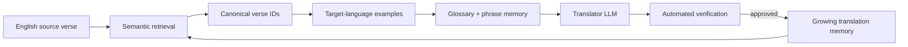

# Adaptive Bible Translation Memory (ABTM)

Can a small translated seed corpus bootstrap useful translation support for the rest of the New Testament in an extremely low-resource language?

ABTM is a research framework for testing that question. It retrieves semantically related English verses, connects them to known target-language examples, builds terminology and phrase memory, prepares a structured translator prompt, and verifies candidate output.

## Core idea



Every approved translation becomes supervision for later verses. The first milestone deliberately starts with a translated Gospel of Mark and evaluates generated translations against hidden references from the rest of the New Testament.

## Concrete example

For an untranslated verse about healing, the system can retrieve known Mark verses containing related actions and vocabulary, attach their canonical target-language translations, add approved terms from the glossary, and ask a translator model for a candidate. Verification then checks missing content, terminology consistency, length anomalies, and reference metrics before the candidate can enter memory.

The current experiment runner uses deterministic nearest-memory placeholder generation instead of calling an LLM. This keeps the retrieval, prompting, memory, verification, and evaluation pipeline reproducible while the model integration remains swappable.

## Repository map

```text
abtm/          retrieval, memory, prompting, verification, and evaluation
configs/       example dataset and experiment configuration
scripts/       open-Bible ingestion and split creation
specs/         research, ingestion, evaluation, and future-work specifications
tests/         canonicalization and dataset-split tests
```

## Quick start

```bash
python -m venv .venv
```

Activate the environment:

```bash
# macOS / Linux
source .venv/bin/activate

# Windows PowerShell
.venv\Scripts\Activate.ps1
```

Install dependencies and prepare the first experiment:

```bash
pip install -r requirements.txt
python scripts/pull_open_bibles.py --out data/bible_dataset --nt-only
python scripts/create_splits.py --verses data/bible_dataset/processed/verses.csv --out data/bible_dataset/splits
```

Run the Mark-only bootstrap:

```bash
python -m abtm.experiments.run_bootstrap \
  --dataset data/bible_dataset/processed/verses.csv \
  --source-version web \
  --target-version <target_version> \
  --split data/bible_dataset/splits/mark_only.json \
  --out runs/mark_only
```

On Windows PowerShell, place the command on one line or replace each trailing `\` with a backtick.

## Test

```bash
python -m unittest discover -s tests
```

## Responsible data use

Do not redistribute copyrighted translations such as ESV, NIV, NLT, or CSB. Use public-domain or openly licensed sources such as the World English Bible, American Standard Version, King James Version, or Open English Bible.
